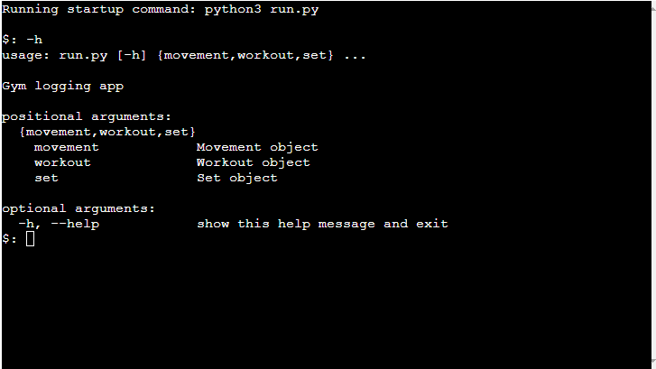
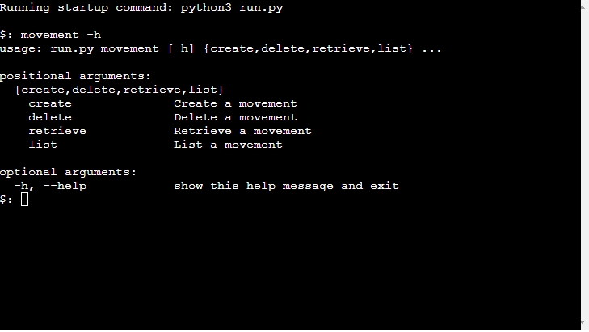
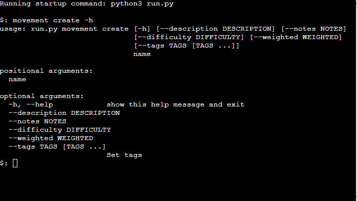
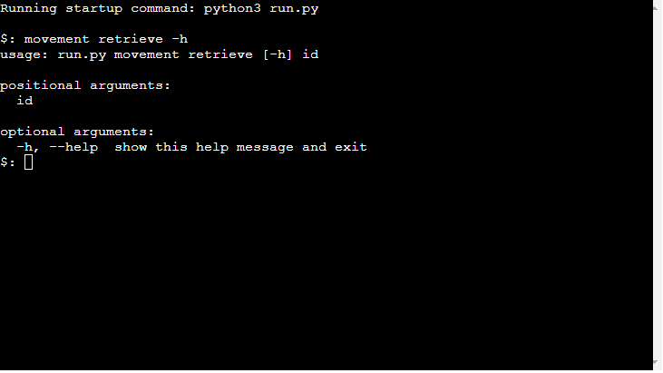
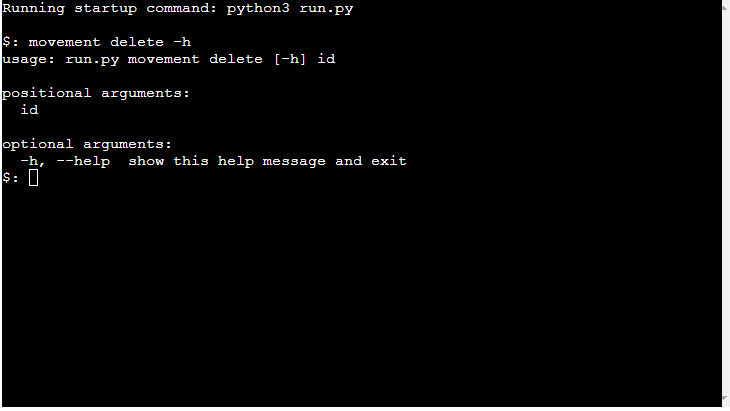
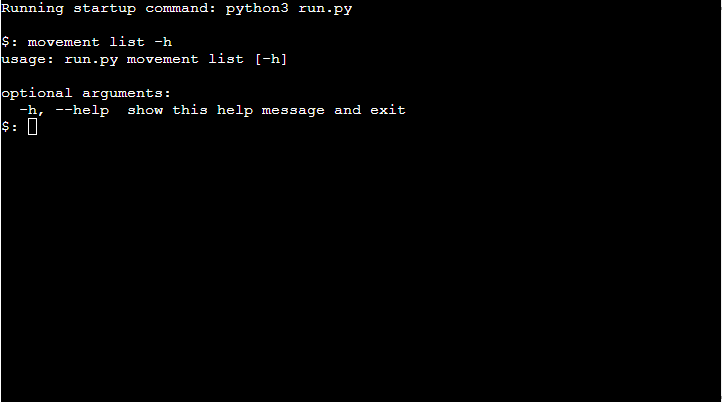
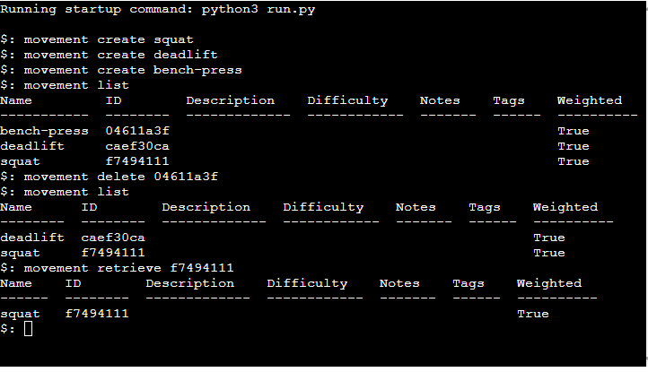

# Solaris Gym Tracker

Solaris Gym Tracker is Python terminal based gym tracker, which runs the Code Institute mock terminal on Heroku.

It was created using the argparse library.

Users have the ability to create, retrieve, list and delete movements, workouts and sets. These objects will be stored in a locally created storage system.

[Here is a link to the live version of this project](https://python-gym-log-ml.herokuapp.com/)


## How to use

To run the app locally, type ```python3 run.py``` into the terminal. If using the live version, you do not need to carry out this step as the mock terminal will do it for you.

Each action will have positional arguments and optional arguments. 

```create``` has a positional argument of name. ```retrieve``` has a positional argument of id. ```delete``` has a positional argument of id ```list``` has no positional arguments.

```-h``` is the help command for argparse applications. Typing ```-h``` after any argument will show a list of all the ways you can use that particular argument. 













If you would like to create a movement, workout or set, you must include te object you would like to create and the positional arguments that accompany that object.
If you wish to create a movement, type ```movement create squat```. 

If you would like to retrieve a movement, workout or set, you must include the object you would like to retrieve and the positional arguments that accompany that object.
For example, If you wish to retrieve a movement, type ```movement retrieve 6af38638```. This 8 character string is an example of an ID.

If you would like to delete a movement, workout or set, you must include the object you would like to delete and the positional arguments that accompany that object.
For example, If you wish to delete a movement, type ```movement delete 6af38638```. This 8 character string is an example of an ID.

If you would like to list a movement, workout or set, you must include the object you would like to list. The list action has no positional arguments.
For example, If you wish to list a movement, type ```movement list```.



## Features

### Existing Features

### Future Features

## Creating the Heroku app

## Data Model

## Testing

### Bugs

- __Solved Bugs__

### Remaining Bugs

### Validator Testing

## Deployment

This project was deployed using Code Institute's mock terminal for Heroku.

- Steps for deployment:
    - Fork or clone this repository
    - Create a new Heroku app
    - Set the buildpacks to ```Python``` and ```NodeJS``` in that order
    - Link the Heroku app to the repository 
    - Select the correct branch and click Deploy Branch under the Manual deploy section


## Credits

- Code Institute for the deployment terminal
