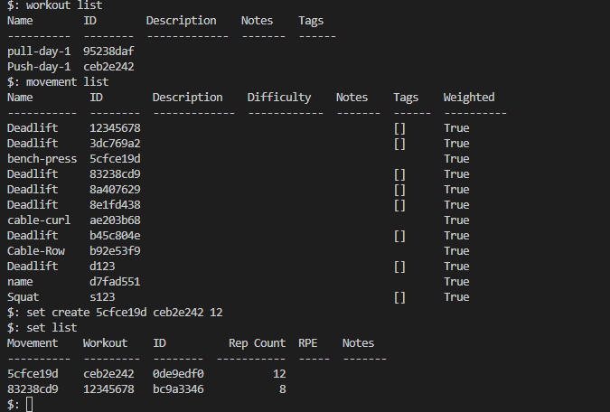

# Python Gym Log

## Overview

Python Gym Log is a command line interface program that runs in the Code Institute mock terminal on Heroku.

The purpose of this app is to allow users to track their progress in the gym over time. Users have the ability to record movements (exercises), sets, and workouts. Users can list (show all instances of that data model), retrieve (show one instance based on the ID given), create or delete whichever data model they are working with.

A [live instance of the application](https://python-gym-log-ml.herokuapp.com/) is hosted using a mock on Heroku.

The project was created as a learning exercise to understand how to create a simple file storage system and MVC design.

### Features

* [CRUD](https://en.wikipedia.org/wiki/Create,_read,_update_and_delete) app which allows users to create, read, update, and delete the related data models: Workout, Movement, and Set.
* Accepts user input
* File storage backend - data is stored using a custom JSON file storage implementation.
* Data displayed in a formatted table using the [tabulate](https://pypi.org/project/tabulate/) library.

### Future Features

* Allow users to update existing instances.

### Data Model

This application implements a simplified [MVC](https://en.wikipedia.org/wiki/Model%E2%80%93view%E2%80%93controller) design pattern.

There are three data models, `Set`, `Movement`, and `Workout` which are persisted using a file storage backend.

Controller functions are defined which hide the complexity of the model code from the view.

The view is a CLI which accepts user input and displays data to the user.

## Getting started

### Running locally

* Clone the repo
* Create and source a virtual environment in the project root: `python -m venv venv && source venv/bin/activate`
* Install requirements: `pip install -r requirements.txt`
* Run the application: `./run.py`
* Enter `-h` at the prompt to see usage instructions

## Example usage

* Initial help: If a user types `-h` or `--help`, they will be shown the positional arguments.

### Movement

* Movement List - If a user wants to list all their recorded movements, they must use the command `movement list`.

* Movement Retrieve - If a user wants to retrieve one particular recorded movement they must use the command `movement retrieve <id>`. The exact ID of the movement they wish to retrieve must be given in order for retrieve that movement e.g. `movement retrieve 3dc769a2`. By using the command `movement list` you can see all IDs for all recorded movements.

* Movement Delete - If a user wants to delete one particular recorded movement they must use the command `movement delete <id>`. The exact ID of the movement they wish to delete must be given in order for delete that movement e.g. `movement delete 3dc769a2`. By using the command `movement list` you can see all IDs for all recorded movements.

* Movement Create - If a user wants to create a movement they must use the command `movement create <name>` e.g. `movement create bench-press`. If the user is adding a movement with a name that is more than one word they must seperate the words with a `-`.

* Movement Create Optional Arguments - When a user is creating a movement they must use the positional argument of name but they also have the choice to use some other optional arguments which include description, notes, difficulty, weighted and tags. By typing `movement create -h` the user will be able to see all the optional arguments they can use.

### Workout

* Workout List - If a user wants to list all their recorded workouts, they must use the command `workout list`.

* Workout Retrieve - If a user wants to retrieve one particular recorded workout they must use the command `workout retrieve <id>`. The exact ID of the workout they wish to retrieve must be given in order for retrieve that workout e.g. `workout retrieve 3dc769a2`. By using the command `workout list` you can see all IDs for all recorded movements.

* Workout Delete - If a user wants to delete one particular recorded movement they must use the command `workout delete <id>`. The exact ID of the workout they wish to delete must be given in order for delete that workout e.g. `workout delete 3dc769a2`. By using the command `workout list` you can see all IDs for all recorded workout.

* Workout Create - If a user wants to create a workout they must use the command `workout create <name>` e.g. `workout create bench-press`. If the user is adding a workout with a name that is more than one word they must seperate the words with a `-`.

* Workout Create Optional Arguments - When a user is creating a workout they must use the positional argument of name but they also have the choice to use some other optional arguments which include description, notes, and tags. By typing `workout create -h` the user will be able to see all the optional arguments they can use.

### Set

* Set List - If a user wants to list all their recorded sets, they must use the command `set list`.

* Set Retrieve - If a user wants to retrieve one particular recorded set they must use the command `set retrieve <id>`. The exact ID of the set they wish to retrieve must be given in order for retrieve that set e.g. `set retrieve 3dc769a2`. By using the command `set list` you can see all IDs for all recorded sets.

* Set Delete - If a user wants to delete one particular recorded set they must use the command `set delete <id>`. The exact ID of the set they wish to delete must be given in order for delete that set e.g. `set delete 3dc769a2`. By using the command `set list` you can see all IDs for all recorded sets.

* Set Create - If a user wants to create a set they must use the command `set create <movement_id> <workout_id> <rep_count>` e.g. `set create 3dc769a2 ceb2e242 12`. The user can use the commands `movement list` and `workout_list` to easily view the IDs they need to create a set.

* Set Create Optional Arguments - When a user is creating a set they must use the positional argument of movement_id, workout_id and rep_count but they also have the choice to use some other optional arguments which include notes, and RPE (rate of perceived exertion). By typing `set create -h` the user will be able to see all the optional arguments they can use.

## Testing

To run the unit tests: `python3 -m unittest`

## Validation

I have also manually tested the project by doing the following:

- Tested in my local terminal and the Code Institute Heroku terminal.
- Passed the code through a PEP8 linter and confirmed there are no problems.

### Movement Model

### Set Model

### Workout Model

### Movement Controller

### Set Controller

### Workout Controller

### File Storage

### Run.py

## Bugs

When using some of the optional arguments such as `description`, if there are too many characters used it will break the formatting of the table used to display the recorded information.

## Deployment

This project was deployed using Code Institute's mock terminal for Heroku.

Steps for deployment:
* Fork or clone this repository
* Create a new Heroku app
* Set the buildpacks to Python and NodeJS in that order
* Link the Heroku app to the repository
* Select the correct branch and click Deploy Branch under the Manual deploy section

## Libraries Used

* Formatted data using [tabulate](https://pypi.org/project/tabulate/) library.
* Nested command parsers using [argparse](https://docs.python.org/3/library/argparse.html). This allows for resources and actions to be combined in user commands, e.g. `movement delete abc-123`.
* [Autopep8](https://pypi.org/project/autopep8/) was used to automatically format each file to make sure it's pep8 complient.

## Credits

* Code Institute for the terminal emulator
